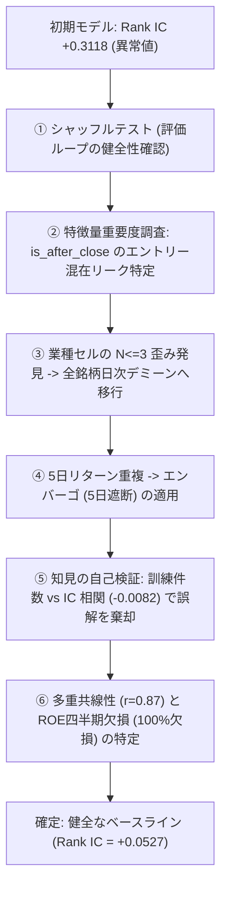

# 日本株決算サプライズ予測・クオンツ検証基盤 (Kabu-AI)

東証上場銘柄の決算発表（適時開示）における **Point-in-time 数値サプライズのアルファ検証**、および **LLM（大規模言語モデル）の定性情報活用に向けた厳密な検証基盤** です。

---

## 📌 プロジェクトの成果と主要ファクト

1. **数値サプライズ（営業利益）のアルファ実証**:
   - 2024年秋〜2025年春の3つの独立した決算期（$T=22$日、2,901イベント）において、**営業利益サプライズ単体で 平均 Rank IC = +0.0527** を確認。
   - 3決算期すべてで一貫して正（2Q: +0.0412, 3Q: +0.0573, FY: +0.0626）。
   - **統計的有意性の限界**:
     > $T=22$ だが5日リターンの重複により実効独立数は8前後。統計的有意性は主張できない。3決算期での符号一貫性（$n=3$、符号検定 $p=0.125$）を根拠とする。

2. **LLM数値入力の限界**:
   - 数値サマリのみを入力した場合、LLM出力は数値サプライズと強く相関（1日41銘柄で $r \approx 0.84$）。開示本文の定性テキストを渡さない限り、数値サプライズを超える増分アルファは期待しにくい。

3. **無料での継続的データ蓄積基盤**:
   - TDnetの適時開示本文（定性テキスト）を日次で自動収集・蓄積するスクレイパーを配備・動作確認済み。

---

## 🔬 偽のアルファを暴いた「7つの診断・リーク修正」の軌跡

本プロジェクトで最も価値があるのは、見かけの「良すぎる数字」を疑い、クオンツ計量経済学のプロトコルに従ってバグとリークを特定・解消したプロセスです。



| # | 発見された問題・異常値 | 診断手法 | 明らかになったこと / 原因の特定 | 実施した修正 |
|---|---|---|---|---|
| 1 | 初期 GBDT の Rank IC が **+0.31** に跳ね上がる | シャッフルテスト（100回試行） | 帰無分布が **+0.0011** に収束し、評価ループ（相関計算等）自体は正常であることを確認 | 特徴量側のリーク調査へ進む |
| 2 | `is_after_close` の Gain が 2.62 と突出 | 特徴量重要度（Gain）の調査 | 場中（+0.56%）と引け後（-4.88%）の初日ギャップをモデルが学習していたリークを特定 | 引け後開示（翌朝寄りエントリー）に全銘柄統一 |
| 3 | 業種中立化後の平均が全日で厳密に 0.000000 | 業種セルごとの銘柄数分布調査 | 170セル中 **48.2% が $N \le 3$、17.1% が $N=1$** で大量のタイ・機械的順位が発生していたことを特定 | 全銘柄日次デミーンへ移行 |
| 4 | 業種ダミー単体の Rank IC が +0.1033 を記録 | エンバーゴ（5日遮断）テスト | 連続する開示日の5日リターン重複による先読みリークを特定 | 5日重複を完全遮断するエンバーゴを適用（ICは +0.0551 に半減） |
| 5 | 「データ増加による進化」仮説 | 訓練件数 vs IC 相関分析 | 相関が **-0.0082（完全無相関）** であり、単なる特定日レジーム差であったことを確認 | 選択的解釈を破棄 |
| 6 | Ridge が -0.0001 に潰れる | 相関行列 ＆ Ridge係数診断 | OPとNPの相関が **0.87** と高すぎ係数が打ち消し合い、ROEは四半期で全件欠損であることを特定 | ROEを除外し、単一特徴量（OP単体: +0.0527）を真のベースラインに確定 |

---

## 📂 ディレクトリ構成

```
kabu-ai/
├── src/
│   ├── data_loader.py          # J-Quants V2 + yfinance によるPoint-in-timeデータセット生成
│   ├── diagnostics.py          # 汎用シャッフルテスト (日内並べ替え) 診断モジュール
│   ├── factor_analysis.py      # 単一特徴量IC・多重共線性・係数診断スクリプト
│   ├── evaluator_extended.py   # エンバーゴ付きウォークフォワード評価
│   ├── evaluator_repaired.py   # 日内ランク正規化・L=7ブロックブートストラップ評価
│   ├── llm_extractor.py        # Qwen2.5-7B による定性特徴量抽出（四半期/本決算分岐プロンプト・再開対応）
│   └── mcp_server.py           # MCP サーバー（手元）。uvx が取り寄せて起動する
├── scripts/
│   ├── news_ingest.py          # 企業ニュースの階層化収集（手元のみ・配信物には含めない）
│   └── tdnet_scraper.py        # TDnet収集（robots.txt により停止。記録として残置）
├── worker/                     # Cloudflare Workers。閲覧統計・開示速報・リモート MCP
│   ├── index.js                # ルーティングと Cron の入口
│   ├── mcp.js                  # MCP サーバー（リモート）。Streamable HTTP を素で実装
│   ├── sources/                # 情報源のアダプタ（既定で動くのは edinet のみ）
│   ├── push.js                 # Web Push の送信（VAPID + aes128gcm を素で実装）
│   └── schema.sql              # D1 のテーブル定義
├── data/
│   ├── extended_clean_dataset.parquet  # 2,901件・T=28日のクリーンデータセット
│   └── tdnet_disclosures/              # スクレイパーによる日次蓄積Parquet
└── results/
    └── repaired_evaluation_results.csv # 各開示日のRank IC測定結果
```

---

## 🚀 使い方

### 1. データセット構築 ＆ ベースライン評価
```bash
# 仮想環境の準備
python -m venv .venv
source .venv/bin/activate
pip install -r requirements.txt

# データセット構築 (2024年秋〜2025年春)
python src/data_loader.py

# シャッフルテストによる健全性診断
python src/diagnostics.py

# 単一特徴量 ＆ 多重共線性診断
python src/factor_analysis.py

# エンバーゴ付きベースライン評価
python src/evaluator_repaired.py
```

### 2. 当日の開示の速報

TDnet のスクレイピングは止めています（`robots.txt` が全面 `Disallow`）。
いま当日の開示を運んでいるのは Cloudflare Workers の巡回で、取得元は EDINET です。
[⚡ 開示の速報](#-開示の速報)を参照してください。

`scripts/tdnet_scraper.py` は記録として残していますが、どこからも自動実行していません。

---

## 🎯 到達点とまとめ

本プロジェクトで到達したのは、**「データと評価に潜むリークや構造的歪みを多角的な診断によって特定・解消し、ノイズに惑わされずにベースラインを測定できる検証パイプラインを構築した」** ことです。
これにより、将来テキストデータが十分に蓄積された際にも、欺瞞のない客観的なアルファ検証を即座に再開できる準備が整いました。

---

## 🕸️ 企業関係グラフブラウザ

有価証券報告書から抽出した資本のつながりを、企業を中心に辿るブラウザです。
ノードは企業、エッジは政策保有と大株主の関係で、**エッジの理由は企業自身が有報に書いた「保有目的」をそのまま表示**します。

```bash
python scripts/edinet_ingest.py --months 13     # 有報の取り込み（要 EDINET_API）
python scripts/extract_financials.py            # 業績を XBRL から組み直す（APIは叩かない）
python scripts/news_ingest.py --all --rotate 7  # ニュース（日次・7日で一周）
python scripts/build_warehouse.py               # data/kabu.duckdb を構築
python scripts/export_browser_json.py           # 配信 JSON を書き出し
cd frontend && npm install && npm run dev
```

| 項目 | 規模 |
|---|---|
| 業績を取れた企業 | 3,822（5期ぶん） |
| ノード（上場企業） | 3,330 |
| 有向エッジ | 35,128 |
| 保有目的が付いたエッジ | 97.1% |
| 持ち合い（相互保有）の特定 | 15,294 本 |
| 企業ドメイン（ファビコン用） | 3,501 社 |

## 📋 データの出所と、公開版に含まれないもの

| 出所 | 内容 | 公開版 |
|---|---|---|
| EDINET | 有報の政策保有・保有目的・大株主・企業ドメイン・社名・業種 | ◯ |
| EDINET | 有報「主要な経営指標等の推移」の業績（売上・利益・自己資本比率・従業員数） | ◯ |
| EDINET | 提出書類の履歴と、**当日の開示速報**（Workers が10分おきに巡回） | ◯ |
| Google ニュース RSS | 企業別の報道見出し（取得日時つき） | **✕**（手元だけ） |
| TDnet | 適時開示のタイトル | **✕**（取得を停止） |
| **J-Quants** | 決算数値・市場区分・TOPIX規模区分・サプライズ特徴量 | **✕** |

Google ニュースと TDnet は、どちらも配信元が `robots.txt` で機械的な取得を拒否しており、
利用規約も再配信を認めていません。ニュースは手元での私的利用に留めて配信物から外し、
TDnet は取得そのものを止めました。**EDINET は公共データ利用規約(PDL1.0)で商用利用まで
認められている**ので、公開版の1次情報はこちらに寄せています。

**J-Quants API は私的利用に限定されており、取得したデータを第三者が閲覧できる状態に置くこと、
およびそのデータを蓄積・中継する構成でアプリを提供することが規約で禁止されています。**
このため公開ビルドでは `build_warehouse.py --public` を使い、J-Quants 由来を完全に除外しています
（企業マスタも EDINET コードリストから組み直します）。

手元で全部入りを見るときは `--public` を外してください。決算・サプライズ・検証ダッシュボードが有効になります。
本リポジトリには J-Quants 由来のデータファイルを含めていません。

### 業績は有報から取り直している

J-Quants を載せられないぶんの穴は、有報の XBRL で埋めてある。
「主要な経営指標等の推移」には5期ぶんの売上・利益・自己資本比率・ROE・従業員数がタグ付けされていて、
`scripts/extract_financials.py` が取り込み済みのキャッシュ（`data/edinet_cache/*.tsv`）から組み直す。
API は叩かないので、何度でもやり直せる。

| 項目 | 取得率 | 備考 |
|---|---|---|
| 売上高 | 99.1% | 銀行は経常収益、保険は正味収入保険料で代替。会社独自タグにも対応 |
| 純利益・自己資本比率 | 99.1% | |
| 営業利益 | 95.5% | 推移表に無いため損益計算書から取る。**直近2期のみ** |
| 1株配当 | 83.0% | 提出会社（単体）の指標として載る |

年1回の開示なので四半期の粒度は落ちる。ここは J-Quants と引き換えに諦めた点である。

## 🔄 更新の運用

| 対象 | 実行場所 | 契機 |
|---|---|---|
| 当日の開示 | Cloudflare Workers | 平日 9:00〜18:50 に10分おき（自動・[⚡ 開示の速報](#-開示の速報)） |
| ニュース | **手元のマシン** | 任意。配信物には含めない（下記） |
| 有価証券報告書 | **手元のマシン** | 年数回、手動または cron |
| サイトの再生成と公開 | GitHub Actions | 毎日 06:00 JST、および `data/` `frontend/` `scripts/` の更新時 |

### ニュースの階層化収集（手元のみ）

Google ニュースは規約と `robots.txt` の双方が自動取得・再表示を禁じているため、
**配信物には含めず、手元での私的利用に留めています。**

全社を毎日舐めると80分かかる一方、鮮度が日単位で要るのはよく見られている会社だけです。
そこで重要度で2階層に分けます。

```bash
python scripts/news_ingest.py --all --rotate 7
```

| | 対象 | 頻度 |
|---|---|---|
| Tier 1 | TOPIX Core30・Large70 と、閲覧の多い上位200社（計300〜400社） | 毎日 |
| Tier 2 | 残り約3,400社 | 7日で一周 |

Tier 2 は証券コードで決まる曜日に当たるので、同じ会社は必ず同じ間隔で観測されます。
乱数で選ぶと間隔がばらつき、あとで時系列として扱えなくなります。
Tier 1 の「閲覧の多い会社」は `GET /trending` から引きます（取れなければ規模区分だけで組みます）。
TOPIX の規模区分は J-Quants 由来なので、`--public` で組んだ倉庫では空になり、売上上位で代替します。

**有報の取り込みだけは GitHub Actions で動きません。**
EDINET API はランナー（Azure のデータセンター IP）からのアクセスを 403 で拒否します。
鍵の有無とは無関係で、鍵を渡さなくても手元からは 200 が返る一方、CI からは全日付が 403 になります。

```bash
bash scripts/update_edinet_local.sh    # 取り込み → 倉庫再構築 → 書き出し → push
```

push を契機に GitHub Actions が動き、サイトが作り直されます。
自動化するなら、有報の提出が集中する時期に合わせて crontab に1行入れておくのが手軽です。

```cron
# 1/4/7/10月の1日 朝5時
0 5 1 1,4,7,10 * cd /path/to/kabu-ai && bash scripts/update_edinet_local.sh >> data/edinet_raw/quarterly.log 2>&1
```

## 📱 ホーム画面アプリ（PWA）

ホーム画面に追加すると、Safari の枠なしで起動し、機内でも開けます。
App Store の審査も年会費も要りません。

配信 JSON は端末内（IndexedDB）に版付きで持ち、画面の外枠は Service Worker が持ちます。
両方で 40MB を抱えないよう、担当を分けてあります。

## ⚙️ 設定（端末ごと）

配色・文字の大きさ・検索エンジン・閲覧統計の可否を端末内に保存する。サーバは持たない。

**AI は Gemini・Claude・ChatGPT から選べる。** API キーを入れるとアプリの中に答えが流れ、
入れなければ選んだ提供元のチャット画面がプロンプトつきで開く。
キーとモデルは提供元ごとに別々に覚える。キーは `localStorage` にだけ置き、
通信は端末から各社へ直接出る。このサイトに受け口が無いので、キーがこちら側を通ることはない。

| 提供元 | ブラウザから直接呼べるか | 備考 |
|---|---|---|
| Gemini | ◯ | 無料枠あり。既定は `gemini-3.8-flash` |
| Claude | ◯（`anthropic-dangerous-direct-browser-access` ヘッダが要る） | 従量課金のみ。既定は `claude-opus-5` |
| ChatGPT | △ | 従量課金のみ。**キーを拒むときだけ CORS ヘッダが返らない**ため、疎通確認は `/v1/models` で行う |
| X（Twitter） | ✕ | プリフライトが 405 で CORS ヘッダも無い。入力欄を置いていない |

モデル名は各社の都合で増減するので、一覧から選ぶほかに直接書ける。

## 🤖 MCP サーバー（対話型AIから直に引く）

画面で見るのが向いているのは、持ち合いの広がりやセクターの分布のような「形」です。
一方で、複数銘柄の突き合わせや保有目的の読み比べは、対話型AIに任せたほうが早い。
そこで、同じデータを **MCP（Model Context Protocol）** で Claude・Cursor・VS Code・Gemini から
引けるようにしてあります。画面はそのまま、AI 用の口を足しただけです。

サイト右上の **🤖 AIで使う (MCP)** から、つなぎ方とクライアントを選べます。

### つなぎ方は2つある

| | リモート | この端末で動かす |
|---|---|---|
| 入れるもの | **無し**（URL を渡すだけ） | uv（`uvx` が同梱） |
| 実体 | `worker/mcp.js`（Cloudflare Workers） | `src/mcp_server.py`（uvx が取り寄せて起動） |
| 通信 | AI → kabu-ai の Worker → 配信データ | AI → 端末のサーバー → 配信データ |
| 記録 | **残していない**（`/mcp` は D1 に何も書かない） | こちらを一切通らない |

どちらも同じ5つの道具を、同じデータから返します。

**リモート**（認証不要。この URL を渡すだけ）:

```
https://kabu-stats.yuya011.workers.dev/mcp
```

* Claude Desktop / claude.ai … 設定 → コネクタ → カスタムコネクタを追加 → URL を貼る
* Claude Code … `claude mcp add --transport http kabu-ai https://kabu-stats.yuya011.workers.dev/mcp`
* Cursor … `~/.cursor/mcp.json` に `{"url": "…/mcp"}`
* VS Code … `.vscode/mcp.json` に `{"type": "http", "url": "…/mcp"}`（外側の名前は `servers`）
* Gemini CLI … `~/.gemini/settings.json` に `{"httpUrl": "…/mcp"}`（`url` は SSE 用なので効かない）

Cursor と VS Code はインストール用リンクの口を公開しているので、押すだけで入ります。

[](cursor://anysphere.cursor-deeplink/mcp/install?name=kabu-ai&config=eyJ1cmwiOiJodHRwczovL2thYnUtc3RhdHMueXV5YTAxMS53b3JrZXJzLmRldi9tY3AifQ==)
[](https://vscode.dev/redirect/mcp/install?name=kabu-ai&config=%7B%22type%22%3A%22http%22%2C%22url%22%3A%22https%3A%2F%2Fkabu-stats.yuya011.workers.dev%2Fmcp%22%7D)

**この端末で動かす**（通信をこちらに通したくない場合）:

```json
{
  "mcpServers": {
    "kabu-ai": {
      "command": "uvx",
      "args": ["--from", "git+https://github.com/yuya011/kabu-ai.git", "kabu-mcp"]
    }
  }
}
```

### 渡している5つの道具

| ツール | 引数 | 返るもの |
|---|---|---|
| `search_company` | `query`, `limit` | 社名・証券コード・業種での銘柄検索 |
| `get_company_profile` | `code` | 有報「主要な経営指標等の推移」による5期の業績、会計基準、四半期 |
| `get_holding_network` | `code`, `direction`, `limit` | 政策保有先・保有元・主要取引先・大株主（保有目的の原文つき） |
| `get_surprise_ranking` | `period`, `top_k` | 決算サプライズの上位銘柄 |
| `get_disclosures` | `code`, `days` | EDINET の提出書類と、臨時報告書の本文（＋当日の速報） |

### 中身の作り

**倉庫（`data/kabu.duckdb`）ではなく、サイトが配っている静的 JSON を読みます。**
倉庫は git に入っていないので、`uvx` で取り寄せた利用者の手元にも、Worker の中にも無いからです。
書き出し済みの JSON なら GitHub Pages から誰でも引けて、しかもサイトと同じものです。
サイトと MCP でデータを別々に組まないので、片方だけ古いということが起きません。

MCP が読むのは画面用の `data/browser/` ではなく、専用の `data/mcp/` です。
粒度が違います。画面は近隣の銘柄を続けて開くので上2桁でまとめた 0.5MB のシャードが得ですが、
MCP は1社ずつ飛び飛びに引かれるので、1社を見るのに 0.5MB を読むことになります。
Cloudflare Workers の CPU 時間にも収まりません。同じ素材から1社1ファイル（中央値 10KB）に
割り直したものが `data/mcp/` で、手元版・リモート版の両方がこれを読みます。
どちらも `scripts/export_browser_json.py` が同時に書き出します。

```
frontend/public/data/mcp/
├── index.json      上場 3,855 社の目録（323KB）
├── c/<コード>.json  企業詳細（中央値 10KB・最大 75KB）
└── surprise.json   決算サプライズの順位（公開版には入らない）
```

**リモート版は素の JSON-RPC で書いてあります。** Worker は node_modules を持たない
素の ESM で、バンドラを挟んでいません。ステートレスな MCP は1往復で終わるので、
SDK を入れるより短く済みます。トランスポートは現行仕様の **Streamable HTTP** です
（計画書に書いた SSE は 2024-11-05 版の旧トランスポートで、いまは非推奨）。
セッションは張らず `Mcp-Session-Id` も出しません（仕様上サーバーの任意）。
サーバー発の通知を使わないので `GET /mcp` は 405 を返します。

認証は求めていません。返すのは公開データだけで、書き込む口も無いためです。
`/.well-known/oauth-*` を 404 のままにしてあり、クライアントは「認証不要のサーバー」と読みます。

手元版の環境変数:

| 環境変数 | 既定 | 用途 |
|---|---|---|
| `KABU_MCP_DATA` | （リポジトリ内なら自動） | 手元の書き出しを使う。公開版に入れていないデータもこれで読める |
| `KABU_MCP_BASE` | `https://yuya011.github.io/kabu-ai/data/mcp` | 配信元。独自ドメインに移したとき差し替える |
| `KABU_MCP_TTL` | `21600`（6時間） | 貯めたぶんの寿命。データは日次更新 |
| `KABU_MCP_STATS` | `https://kabu-stats.yuya011.workers.dev` | 当日の開示速報の口。空にすると引きにいかない |

リモート版の配信元は `worker/wrangler.toml` の `MCP_DATA_BASE` で差し替えます。

決算サプライズは、元になる決算短信が J-Quants 由来のため公開データに含めていません。
`get_surprise_ranking` は公開データに対しては空を返し、その理由を添えます。
手元で `--public` を付けずに書き出したものを `KABU_MCP_DATA` で指すと値が返ります。

### 動作の確認

```bash
# 手元版
pip install "mcp>=1.2.0"
python -c "import sys; sys.path.insert(0,'.'); from src.mcp_server import search_company; print(search_company('キーエンス'))"

# リモート版
curl -sX POST https://kabu-stats.yuya011.workers.dev/mcp \
  -H 'Content-Type: application/json' -H 'Accept: application/json, text/event-stream' \
  -d '{"jsonrpc":"2.0","id":1,"method":"tools/list"}' | head -c 400
```

## 📈 閲覧統計（任意）

「どの企業がどれくらい調べられているか」を貯めるための受け口を `worker/` に置いています。
**利用者を区別する値（ID・Cookie・端末情報・IPアドレス）は作らず、送らず、保存しません。**
記録するのは銘柄コード・日付・時間帯・国の4つだけで、個人情報を扱わない構成です。

```bash
cd worker
npx wrangler d1 create kabu-stats                       # 払い出された id を wrangler.toml へ
npx wrangler d1 execute kabu-stats --file schema.sql --remote
npx wrangler deploy
```

既に展開済みの D1 に後から表を足すときも、同じ `schema.sql` をそのまま流せます
（すべて `CREATE TABLE IF NOT EXISTS` なので、既存の行は触りません）。

配置したら、フロントのビルド時に送り先を渡します。設定しなければ何も送りません。

```bash
VITE_ANALYTICS_URL=https://kabu-stats.yuya011.workers.dev npm run build
```

公開ビルドでは [.github/workflows/update-and-publish.yml](.github/workflows/update-and-publish.yml) が
この値を渡している。手元の `npm run dev` では未設定なので何も送らない。

## ⚡ 開示の速報

配信 JSON は1日1回の作り直しなので、その日に出た開示は載りません。
そこだけを Cloudflare Workers が**平日 9:00〜18:50 に10分おき**で巡回し、D1 に積んでいます。
画面は概観の「本日の開示」と、銘柄詳細の先頭でそれを読みます。

```
Cron (10分毎) ──▶ sources/edinet.js ──▶ D1: today_disclosures ──┬─▶ GET /disclosures/today
                                                                ├─▶ GET /news?code=XXXX
                                                                └─▶ Web Push（監視銘柄のみ）
```

### 取得元は入れ替えられる

`worker/sources/` にアダプタとして分けてあり、どれを使うかは `wrangler.toml` の
`SOURCES` で決まります。**既定は `edinet` だけです。**

| アダプタ | 既定 | 理由 |
|---|---|---|
| `edinet` | **有効** | 公共データ利用規約(PDL1.0)。出典を明記すれば再配信まで認められている |
| `tdnet` | 無効 | `release.tdnet.info/robots.txt` が `User-agent: * / Disallow: /` |
| `gnews` | 無効 | `news.google.com/robots.txt` が `/rss/` を `Disallow`。規約も再表示を禁じている |

決算短信は TDnet 側にしか出ないため、EDINET だけでは拾えません。
短信まで速報したいなら、筋は **JPX の TDnet API サービス（有料・再配信可）**を契約して
`TDNET_API_BASE` を渡すことです。契約すれば `sources/tdnet.js` の JSON 経路だけが動き、
HTML の解析には落ちません。

`/news` と `/disclosures/today` には 15分・60秒の `Cache-Control` を付けています。
ただし **`workers.dev` のサブドメインでは Cloudflare の Cache API が働きません**
（`put` が素通りし、`match` は常に外れる）。独自ドメインに移すまで、キャッシュが効くのは
各ブラウザの中だけです。既定の構成で外部に出るのは Cron の巡回だけなので実害はありませんが、
`gnews` のようなオンデマンドのアダプタを有効にするなら、先に独自ドメインへ移してください。

### 展開したら最初に確かめること

**EDINET API が Cloudflare のエッジから通るかは、展開してみるまで分かりません。**
EDINET は GitHub Actions のランナー（Azure のデータセンター IP）を 403 で拒否します。
Workers も同じ扱いを受ける可能性があり、その場合 `GET /sources` の `last_status` に
`edinet: err:...` が残ります。弾かれるようなら、巡回だけを手元の cron から
`POST /collect` に投げる形（Workers は受け口と配信に徹する）に寄せれば動きます。

### 動作の確認

```bash
npx wrangler secret put EDINET_KEY        # EDINET API のキー
npx wrangler secret put COLLECT_TOKEN     # 手で巡回を蹴るための合言葉

# Cron を待たずに1回走らせる。?date= を付ければ過去日も埋め戻せる
curl -X POST -H "Authorization: Bearer <COLLECT_TOKEN>" \
  "https://kabu-stats.yuya011.workers.dev/collect?date=2026-09-08"

# いま何が有効で、最後にいつ巡回したか
curl https://kabu-stats.yuya011.workers.dev/sources
```

## 🔔 通知（任意）

監視している銘柄に**臨時報告書・大量保有報告書・公開買付の届出**が出たときだけ鳴らします。
有報や四半期報告書は日程の決まった定期開示なので対象にしていません。

iOS 16.4 以降なら、ホーム画面に追加した PWA のまま受け取れます。

```bash
node worker/vapid-keygen.mjs              # 鍵をひと組つくる
# 出力の public を wrangler.toml の [vars] VAPID_PUBLIC に入れる
npx wrangler secret put VAPID_PRIVATE     # private はこちら
npx wrangler deploy
```

`VAPID_PUBLIC` が空のあいだは通知の口が 503 を返し、**設定画面にも通知の欄が出ません**。
鍵を作り直すと既存の購読は全部無効になるので、一度作ったら使い回してください。

預かるのは「この購読で、この銘柄を鳴らす」という組だけです。購読の宛先は配信元
（FCM 等）が発行する URL で、こちらから利用者を特定する材料にはなりません。
監視したい銘柄の一覧は端末の `localStorage` に置き、通知を切れば控えも消します。

送信は `worker/push.js` で RFC 8291（aes128gcm）と RFC 8292（VAPID）を素で実装しています。
Workers に web-push ライブラリは持ち込めませんが、必要な素材（ECDH P-256・HKDF・
AES-GCM・ECDSA 署名）は WebCrypto に揃っています。

## 💰 広告（未設定）

広告は発行元IDが設定されているときだけ描く。未設定なら枠も出さないし、
ビルドにコードも残らない（Vite が丸ごと落とす）。

**AdSense は自分で取得したドメインでないと審査を受けられない。**
`github.io` は GitHub が持つ共有ドメインなので、独自ドメインへ移すまで設定できない。

移行はリポジトリ変数を2つ入れるだけでよい。

| 変数 | 例 | 効果 |
|---|---|---|
| `CUSTOM_DOMAIN` | `kabu-graph.com` | CNAME を書き、base を `/` に切り替える |
| `ADSENSE_PUBLISHER_ID` | `ca-pub-...` | ads.txt を生成し、広告枠を描く |

設定場所は Settings → Secrets and variables → Actions → Variables。
ドメイン側では、GitHub Pages の IP へ A レコードを向ける（または CNAME を `<user>.github.io` へ）。
