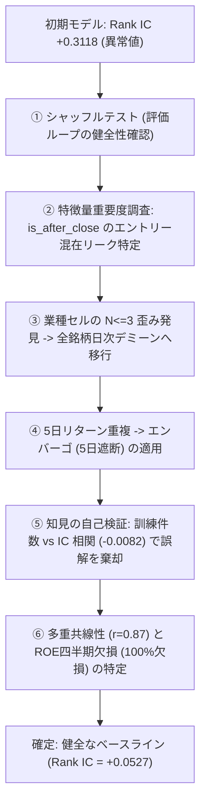

# 日本株決算サプライズ予測・クオンツ検証基盤 (Kabu-AI)

東証上場銘柄の決算発表（適時開示）における **Point-in-time 数値サプライズのアルファ検証**、および **LLM（大規模言語モデル）の定性情報活用に向けた厳密な検証基盤** です。

---

## 📌 プロジェクトの成果と主要ファクト

1. **数値サプライズ（営業利益）のアルファ実証**:
   - 2024年秋〜2025年春の3つの独立した決算期（$T=22$日、2,901イベント）において、**営業利益サプライズ単体で 平均 Rank IC = +0.0527** を確認。
   - 3決算期すべてで一貫して正（2Q: +0.0412, 3Q: +0.0573, FY: +0.0626）。
   - **統計的有意性の限界**:
     > $T=22$ だが5日リターンの重複により実効独立数は8前後。統計的有意性は主張できない。3決算期での符号一貫性（$n=3$、符号検定 $p=0.125$）を根拠とする。

2. **LLM数値入力の限界**:
   - 数値サマリのみを入力した場合、LLM出力は数値サプライズと強く相関（1日41銘柄で $r \approx 0.84$）。開示本文の定性テキストを渡さない限り、数値サプライズを超える増分アルファは期待しにくい。

3. **無料での継続的データ蓄積基盤**:
   - TDnetの適時開示本文（定性テキスト）を日次で自動収集・蓄積するスクレイパーを配備・動作確認済み。

---

## 🔬 偽のアルファを暴いた「7つの診断・リーク修正」の軌跡

本プロジェクトで最も価値があるのは、見かけの「良すぎる数字」を疑い、クオンツ計量経済学のプロトコルに従ってバグとリークを特定・解消したプロセスです。



| # | 発見された問題・異常値 | 診断手法 | 明らかになったこと / 原因の特定 | 実施した修正 |
|---|---|---|---|---|
| 1 | 初期 GBDT の Rank IC が **+0.31** に跳ね上がる | シャッフルテスト（100回試行） | 帰無分布が **+0.0011** に収束し、評価ループ（相関計算等）自体は正常であることを確認 | 特徴量側のリーク調査へ進む |
| 2 | `is_after_close` の Gain が 2.62 と突出 | 特徴量重要度（Gain）の調査 | 場中（+0.56%）と引け後（-4.88%）の初日ギャップをモデルが学習していたリークを特定 | 引け後開示（翌朝寄りエントリー）に全銘柄統一 |
| 3 | 業種中立化後の平均が全日で厳密に 0.000000 | 業種セルごとの銘柄数分布調査 | 170セル中 **48.2% が $N \le 3$、17.1% が $N=1$** で大量のタイ・機械的順位が発生していたことを特定 | 全銘柄日次デミーンへ移行 |
| 4 | 業種ダミー単体の Rank IC が +0.1033 を記録 | エンバーゴ（5日遮断）テスト | 連続する開示日の5日リターン重複による先読みリークを特定 | 5日重複を完全遮断するエンバーゴを適用（ICは +0.0551 に半減） |
| 5 | 「データ増加による進化」仮説 | 訓練件数 vs IC 相関分析 | 相関が **-0.0082（完全無相関）** であり、単なる特定日レジーム差であったことを確認 | 選択的解釈を破棄 |
| 6 | Ridge が -0.0001 に潰れる | 相関行列 ＆ Ridge係数診断 | OPとNPの相関が **0.87** と高すぎ係数が打ち消し合い、ROEは四半期で全件欠損であることを特定 | ROEを除外し、単一特徴量（OP単体: +0.0527）を真のベースラインに確定 |

---

## 📂 ディレクトリ構成

```
kabu-ai/
├── src/
│   ├── data_loader.py          # J-Quants V2 + yfinance によるPoint-in-timeデータセット生成
│   ├── diagnostics.py          # 汎用シャッフルテスト (日内並べ替え) 診断モジュール
│   ├── factor_analysis.py      # 単一特徴量IC・多重共線性・係数診断スクリプト
│   ├── evaluator_extended.py   # エンバーゴ付きウォークフォワード評価
│   ├── evaluator_repaired.py   # 日内ランク正規化・L=7ブロックブートストラップ評価
│   └── llm_extractor.py        # Qwen2.5-7B による定性特徴量抽出（四半期/本決算分岐プロンプト・再開対応）
├── scripts/
│   └── tdnet_scraper.py        # TDnet適時開示テキスト日次自動収集スクリプト
├── data/
│   ├── extended_clean_dataset.parquet  # 2,901件・T=28日のクリーンデータセット
│   └── tdnet_disclosures/              # スクレイパーによる日次蓄積Parquet
└── results/
    └── repaired_evaluation_results.csv # 各開示日のRank IC測定結果
```

---

## 🚀 使い方

### 1. データセット構築 ＆ ベースライン評価
```bash
# 仮想環境の準備
python -m venv .venv
source .venv/bin/activate
pip install -r requirements.txt

# データセット構築 (2024年秋〜2025年春)
python src/data_loader.py

# シャッフルテストによる健全性診断
python src/diagnostics.py

# 単一特徴量 ＆ 多重共線性診断
python src/factor_analysis.py

# エンバーゴ付きベースライン評価
python src/evaluator_repaired.py
```

### 2. TDnet 適時開示テキストの日次蓄積
```bash
# 日次スクレイピングの実行 (cron等で平日17:00に定期実行)
python scripts/tdnet_scraper.py
```

※ cron 設定例（平日18:00に自動実行）:
```cron
0 18 * * 1-5 cd /Users/yuyahiraga/Desktop/products/In-house-development/kabu-ai && .venv/bin/python scripts/tdnet_scraper.py >> data/tdnet_disclosures/scraper.log 2>&1
```

---

## 🎯 到達点とまとめ

本プロジェクトで到達したのは、**「データと評価に潜むリークや構造的歪みを多角的な診断によって特定・解消し、ノイズに惑わされずにベースラインを測定できる検証パイプラインを構築した」** ことです。
これにより、将来テキストデータが十分に蓄積された際にも、欺瞞のない客観的なアルファ検証を即座に再開できる準備が整いました。

---

## 🕸️ 企業関係グラフブラウザ

有価証券報告書から抽出した資本のつながりを、企業を中心に辿るブラウザです。
ノードは企業、エッジは政策保有と大株主の関係で、**エッジの理由は企業自身が有報に書いた「保有目的」をそのまま表示**します。

```bash
python scripts/edinet_ingest.py --months 13     # 有報の取り込み（要 EDINET_API）
python scripts/news_ingest.py --all --rotate 7  # ニュース（日次・7日で一周）
python scripts/build_warehouse.py               # data/kabu.duckdb を構築
python scripts/export_browser_json.py           # 配信 JSON を書き出し
cd frontend && npm install && npm run dev
```

| 項目 | 規模 |
|---|---|
| ノード（上場企業） | 3,330 |
| 有向エッジ | 35,128 |
| 保有目的が付いたエッジ | 97.1% |
| 持ち合い（相互保有）の特定 | 15,294 本 |
| 企業ドメイン（ファビコン用） | 3,501 社 |

## 📋 データの出所と、公開版に含まれないもの

| 出所 | 内容 | 公開版 |
|---|---|---|
| EDINET | 有報の政策保有・保有目的・大株主・企業ドメイン・社名・業種 | ◯ |
| Google ニュース RSS | 企業別の報道見出し（取得日時つき） | ◯ |
| TDnet | 適時開示のタイトル | ◯ |
| **J-Quants** | 決算数値・市場区分・TOPIX規模区分・サプライズ特徴量 | **✕** |

**J-Quants API は私的利用に限定されており、取得したデータを第三者が閲覧できる状態に置くこと、
およびそのデータを蓄積・中継する構成でアプリを提供することが規約で禁止されています。**
このため公開ビルドでは `build_warehouse.py --public` を使い、J-Quants 由来を完全に除外しています
（企業マスタも EDINET コードリストから組み直します）。

手元で全部入りを見るときは `--public` を外してください。決算・サプライズ・検証ダッシュボードが有効になります。
本リポジトリには J-Quants 由来のデータファイルを含めていません。
